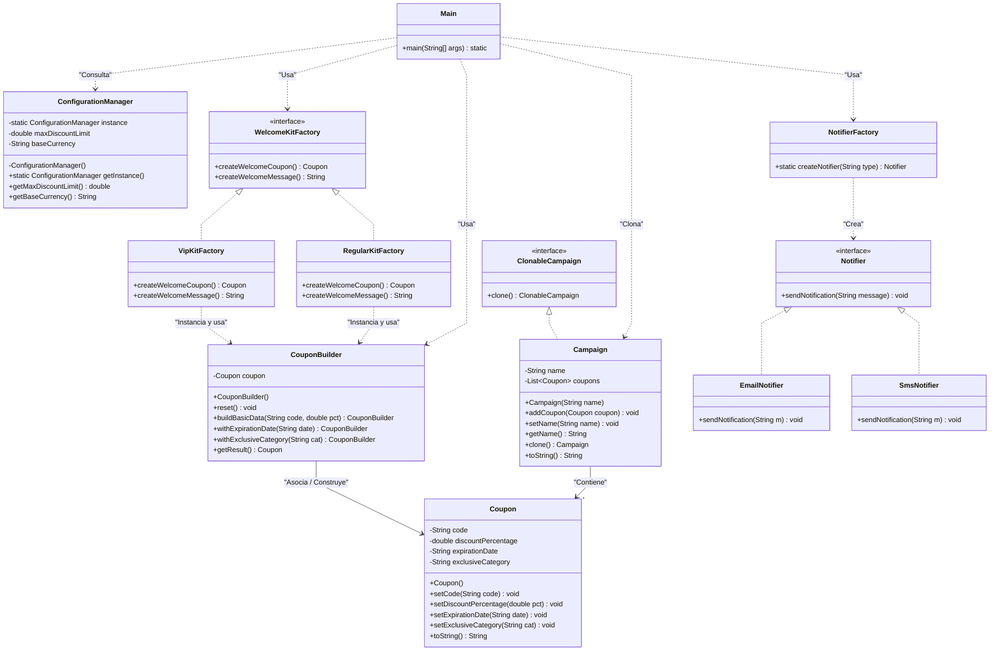

# 🎟️ Campaign & Coupon Management System - Backend

Este proyecto es un simulador backend puro en Java nativo diseñado para demostrar la aplicación práctica y desacoplada de los **5 patrones de diseño creacionales** de la Gang of Four (GoF). El sistema orquesta la creación y gestión dinámica de campañas publicitarias y cupones de beneficios sin dependencias externas.

## 💡 Patrones Aplicados

* **Singleton (`config`)**: Centraliza un `ConfigurationManager` único para resguardar las reglas de negocio globales en memoria.
* **Builder (`model`)**: Separa la construcción compleja de los cupones (`CouponBuilder`) en una clase independiente para lograr interfaces fluidas paso a paso.
* **Prototype (`model`)**: Implementa clonación profunda (`Campaign`) para duplicar campañas base estacionales de forma ágil e inmutable en memoria.
* **Factory Method (`factory`)**: Abstrae la instanciación de los canales de alerta (`NotifierFactory`), aislando el core del negocio del medio final de envío (Email/SMS).
* **Abstract Factory (`factory`)**: Genera familias de objetos compatibles (mensajes de bienvenida + cupones) según el perfil de suscripción del usuario (VIP/Regular).

---

## 🏛️ Diagrama de Clases (UML)

## 🛠️ Tecnologías y Ejecución

* **Stack**: Java 17+ (POO pura sin frameworks externos).
* **Clonación**: `git clone https://github.com/lucasberonvonbrand/creational-patterns.git`
* **Ejecución**: Abrir en tu IDE y correr el método `main` en `src/main/java/com/creationalpatterns/Main.java`.

## 👨‍💻 Autor

- **Lucas Ruben Beron Von Brand**
